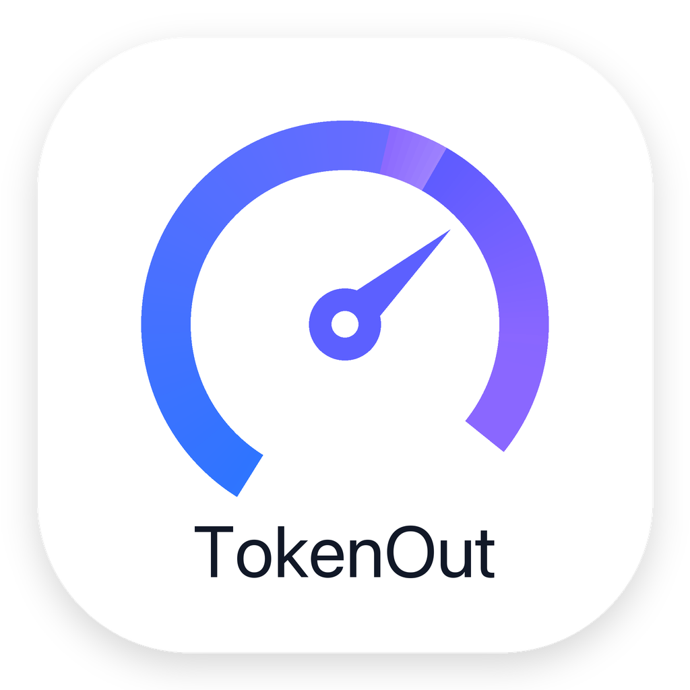
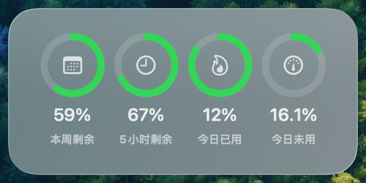

# 清零 TokenOut

**清零（TokenOut）** 是一个 macOS 桌面小组件，用来提醒自己把每天的 Codex Token 额度用完。

它会在桌面上显示几个额度圈，让你一眼看到今天还需要继续使用多少额度。

<p align="center">
  
</p>

## 截图

<p align="center">
  
</p>

## 主要功能

- 显示本周剩余额度
- 显示 5 小时剩余额度
- 显示今日已用额度
- 显示今日未用额度
- 低于 20% 时使用红色提示
- 后台每 1 分钟自动更新
- 支持作为 macOS 原生 WidgetKit 小组件拖到桌面

## 为什么叫清零

这个组件的目的很简单：提醒自己不要浪费每天可用的 Codex Token。

每天看到桌面上的数字，就知道今天还有多少额度需要继续使用，尽量把当天目标清零。

## 数据来源

TokenOut 通过本机 Codex App Server 读取额度数据，请求方法是：

```text
account/rateLimits/read
```

后台脚本会把读取到的数据写入：

```text
/Applications/TokenOut.app/Contents/Resources/snapshot.json
```

当天起点会单独保存到：

```text
~/Library/Application Support/TokenOut/daily-baseline.json
```

桌面小组件读取这个快照文件并展示。

## 指标口径

- 本周剩余：`100 - weekly usedPercent`
- 5 小时剩余：`100 - primary usedPercent`
- 今日已用：记录当天第一次刷新时的本周已用值，之后用当前本周已用减去这个基准估算
- 今日未用：按当前自然日累计目标减去本周已用额度估算，前几天没用完的目标会计入今天

说明：当前 Codex 额度接口没有直接返回“本地当天 0 点以来已用多少”的字段，所以 `今日已用` 从当天第一次刷新后开始记录。

## 后台刷新

TokenOut 使用 LaunchAgent 后台更新：

```text
local.tokenout.fetch
```

刷新频率：

```text
60 秒
```

LaunchAgent 模板文件：

```text
Scripts/local.tokenout.fetch.plist
```

## 构建要求

- macOS 14+
- Xcode
- 本机已安装 Codex App

构建命令：

```bash
xcodebuild \
  -project CodexQuota.xcodeproj \
  -scheme CodexQuota \
  -configuration Debug \
  -derivedDataPath /private/tmp/CodexQuotaDerivedData \
  -allowProvisioningUpdates \
  build
```

构建产物：

```text
/private/tmp/CodexQuotaDerivedData/Build/Products/Debug/TokenOut.app
```

## 本地安装

复制 App：

```bash
rm -rf /Applications/TokenOut.app
cp -R /private/tmp/CodexQuotaDerivedData/Build/Products/Debug/TokenOut.app /Applications/TokenOut.app
xattr -cr /Applications/TokenOut.app
```

安装后台脚本：

```bash
mkdir -p "$HOME/Library/Application Support/TokenOut" "$HOME/Library/Logs" "$HOME/Library/LaunchAgents"
cp Scripts/fetch-quota.js "$HOME/Library/Application Support/TokenOut/fetch-quota.js"
cp Scripts/local.tokenout.fetch.plist "$HOME/Library/LaunchAgents/local.tokenout.fetch.plist"
launchctl bootstrap gui/$(id -u) "$HOME/Library/LaunchAgents/local.tokenout.fetch.plist"
launchctl kickstart -k gui/$(id -u)/local.tokenout.fetch
```

注册小组件：

```bash
/System/Library/Frameworks/CoreServices.framework/Frameworks/LaunchServices.framework/Support/lsregister \
  -f -R -trusted /Applications/TokenOut.app
pluginkit -e use -i local.tokenout.app.widget
```

然后打开 macOS 小组件面板，搜索：

```text
TokenOut
```

## 项目标识

- App 名称：`TokenOut`
- 中文名：`清零`
- App bundle id：`local.tokenout.app`
- Widget bundle id：`local.tokenout.app.widget`
- LaunchAgent id：`local.tokenout.fetch`

## 状态

这是一个自用型 macOS 工具，当前没有上架 Mac App Store。
